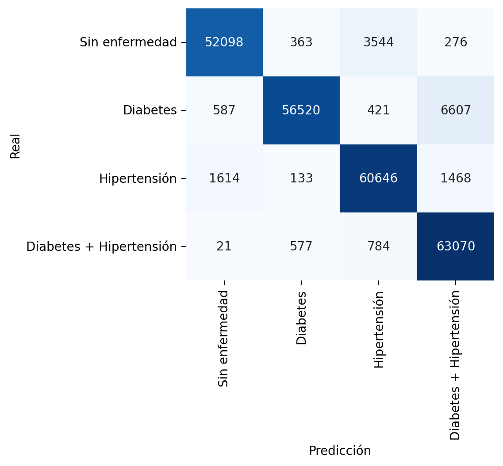
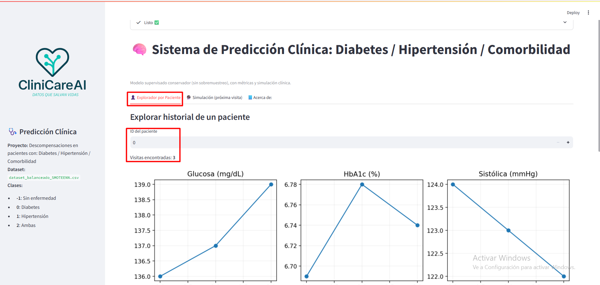
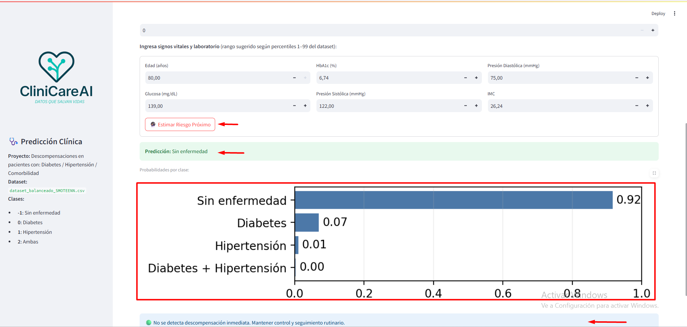
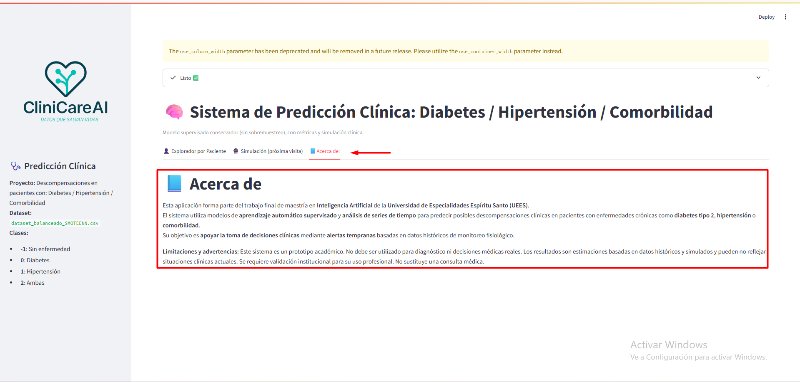
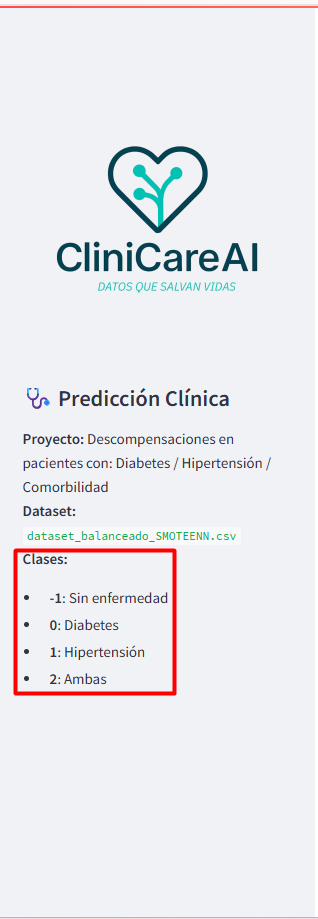

# 🧠 Sistema Inteligente de Predicción de Descompensaciones Clínicas (diabetes tipo 2, hipertensión arterial y/o comorbilidades)


**Diseñar, implementar y evaluar un sistema inteligente basado en modelos de aprendizaje automático supervisado y análisis de series de tiempo, capaz de predecir descompensaciones clínicas en pacientes con enfermedades crónicas (diabetes tipo 2, hipertensión o la combinación de ambas), utilizando datos históricos de monitoreo fisiológico, con el propósito de generar soluciones tempranas que puedan integrarse en una futura plataforma de monitoreo clínico.**

---

## 📑 Tabla de Contenidos
- [Descripción del Problema](#-descripción-del-problema)
- [Dataset](#-dataset)
- [Metodología](#-metodología)
- [Resultados](#-resultados)
- [⚙️ Instalacion y uso](#-instalacion-y-uso)
- [📗 Ejemplo de uso](#-ejemplo-de-uso)
- [💻 Interfaz de Usuario](#-interfaz-de-usuario)
- [📁 Estructura del Proyecto](#-estructura-del-proyecto)
- [⚖️ Consideraciones Éticas](#-consideraciones-éticas)
- [👥 Autores y Contribuciones](#-autores-y-contribuciones)
- [📜 Licencia](#-licencia)
- [🙏 Agradecimientos y Referencias](#-agradecimientos-y-referencias)
 

---

## 🩺 Descripción del Problema

El sistema aborda la necesidad de **predecir de manera temprana descompensaciones en pacientes con enfermedades crónicas**, principalmente **diabetes tipo 2**, **hipertensión arterial** o ambas enfermedades. El objetivo es proporcionar **alertas preventivas** basadas en el análisis de datos fisiológicos históricos, para apoyar en la toma de decisiones médicas oportunas y reducir complicaciones futuras en los pacientes.

**Importancia:**  
El monitoreo continuo de pacientes con enfermedades crónicas genera grandes volúmenes de datos. Sin herramientas inteligentes, estos datos permanecen infrautilizados. Este sistema busca **convertir información fisiológica en conocimiento clínico accionable**.

**Usuarios objetivo:**  
- Profesionales de la salud (médicos, enfermeras, analistas clínicos y gestores clínicos).  
- Investigadores en salud digital.  
- Plataformas de monitoreo remoto y telemedicina.  
- Pacientes con enfermedades crónicas (diabetes tipo 2, hipertensión y/o comorbilidad) 
- Desarrolladores e investigadores de IA clínica
---

## 📊 Dataset

- **Nombre:** `dataset_balanceado_SMOTEENN.csv`  
- **Fuente:** Dataset sintético balanceado a partir de datos clínicos reales anonimizados.  
- **Licencia:** Uso académico y de investigación.  
- **Tamaño:** ~1,000,000 registros y 24 variables.  
- **Variables principales:** `blood_glucose_level`, `HbA1c_level`, `systolic_bp`, `diastolic_bp`, `bmi`, `target` y `age`.  
- **Estructura temporal:** columna `visit` para representar series históricas.  
- **Disponibilidad:** uso interno, no público.

---

## 🧠 Metodología

### Tipo de modelo
Se utilizó un **Random Forest Classifier** por su capacidad de manejar variables correlacionadas y evitar sobreajuste sin sobremuestreo artificial. Esta elección fue especialmente adecuada para un proyecto de clasificación multiclase, dada su robustez y buen desempeño en contextos con múltiples categorías objetivo.

### Preprocesamiento
- Imputación de valores faltantes mediante reglas médico-realistas, basada en el comportamiento clínico esperado de pacientes con enfermedades crónicas.
- Creación de variable derivada: `pulse_pressure = systolic_bp - diastolic_bp`.
- Creación de Variable `Target` para analizar los pacientes con: diabetes tipo 2, hipertensión arterial y/o comorbilidades.
- Balanceo de dataset con algoritmo `Smontenn`.  
- División estratificada 75 % entrenamiento / 25 % prueba.  

### Optimización
- `max_depth = 15` óptimo
- `min_samples_split = 2`
- `min_samples_leaf = 1`
- `n_estimators = 200`  
- `max_features='sqrt'`
- `criterion = "gini”` óptimo 
 

### Métricas
- F1 score (macro)
- Precision (macro)  
- Recall (macro)
- Matriz de confusión (clases: -1, 0, 1, 2) 

---

## 📈 Resultados

| Métrica | Valor |
|----------|--------|
| Precision | **0.938** |
| Recall | **0.934** |
| F1 | **0.934** |


### 📊 Matriz de Confusión

<p align="center">
 
</p>
<p align="center"><em>Figura 1. Matriz de confusión del modelo Random Forest.</em></p>


**Variables más influyentes:** HbA1c, presión sistólica y glucosa.  
**Matriz de confusión:** equilibrio adecuado entre clases (diabetes / hipertensión).

---

## ⚙️ Instalacion y uso

### Requisitos
- Python ≥ 3.8  
- Navegador moderno (Chrome, Edge, Firefox u otros)

### Instalación

```bash
git clone https://github.com/Clinical-Decompensation-Prediction/Clinical-Decompensation-Prediction.git
cd Clinical Descompensation Prediction
pip install -r requirements.txt
```
### Comandos para ejecutar el proyecto
1. Instalar dependencias (solo la primera vez)
- pip install streamlit
- pip install -r requirements.txt

2. Correr el programa

3. Ubicar la carpeta del proyecto donde está el archivo principal y ejecutar:
streamlit run app.py

4. Ver la aplicación e interactuar, se abrirá automáticamente en el navegador.
http://localhost:8501

### 📗 Ejemplo de uso

Carga automática del dataset.

Entrenamiento del modelo Random Forest.

Visualización de métricas y reportes.

Simulación de nueva visita con signos vitales para predicción de riesgo.

---

### 💻 Interfaz de Usuario

Desarrollada en **Streamlit**, con cuatro secciones principales:

| Pestaña | Descripción |
|----------|-------------|
| 👤 **Explorador por Paciente** | Análisis de evolución fisiológica por ID y visita. |
| 🔮 **Simulación (Próxima visita)** | Estimación del riesgo futuro con nuevos valores ingresados. |
| 📘 **Acerca de:** | Presenta la información técnica del modelo, las clases utilizadas, la distribución de datos y los parámetros empleados en el entrenamiento. |

## 🏥 Descripción general
CliniCareAI es una aplicación de apoyo a la toma de decisiones clínicas que utiliza modelos de **aprendizaje automático supervisado** para estimar el riesgo de descompensaciones en pacientes con enfermedades crónicas.  
El sistema permite explorar historiales clínicos, simular próximas visitas y revisar información general del proyecto.

---

## 🧭 Navegación principal

La interfaz principal cuenta con tres secciones accesibles desde la parte superior del panel:

### 👤 Explorador por Paciente  
Permite ingresar un ID de paciente y visualizar su evolución clínica en distintas visitas.  
- Se muestran gráficos de tendencias de variables como **glucosa (mg/dL)**, **HbA1c (%)** y **presión sistólica (mmHg)**.  
- En la parte superior se indica el número de visitas encontradas.

<p align="center">
 
</p>
<p align="center"><em>Figura 2. Explorador por Paciente.</em></p>

📊 **Ejemplo visual:**  
El sistema muestra la evolución temporal de los parámetros fisiológicos del paciente seleccionado, facilitando el análisis comparativo entre visitas.

---

### 🔮 Simulación (Próxima visita)  
En esta sección se pueden introducir manualmente signos vitales y valores de laboratorio (edad, glucosa, HbA1c, presión sistólica, presión diastólica e IMC).  

1. Ingresa los valores clínicos según el rango sugerido (percentiles 1–99 del dataset).  
2. Presiona **“Estimar Riesgo Próximo”** para calcular el riesgo inmediato.  
3. El sistema mostrará la probabilidad de pertenecer a cada clase:

| Código | Clase |
|:-------:|:------|
| -1 | Sin enfermedad |
| 0 | Diabetes |
| 1 | Hipertensión |
| 2 | Ambas |

📈 **Resultado:**  
Se despliega un gráfico de barras con las probabilidades y una alerta de resultado, por ejemplo:  
- 🟢 *Predicción: Sin enfermedad*  
- 🔴 *Predicción: Riesgo de diabetes / hipertensión*

<p align="center">
 
</p>
<p align="center"><em>Figura 3. Simulación (Próxima visita).</em></p>

---

### 📘 Acerca de:  
Contiene la información general del proyecto, su propósito académico y las advertencias sobre su uso.  

📄 **Contenido principal:**
- Proyecto desarrollado como parte de la **Maestría en Inteligencia Artificial** de la **Universidad de Especialidades Espíritu Santo (UEES)**.  
- Utiliza modelos de **aprendizaje supervisado** y **series de tiempo** para analizar posibles descompensaciones clínicas.  
- Enfatiza que el sistema **no debe utilizarse con fines médicos reales**, sino como un **prototipo académico**.

<p align="center">

</p>
<p align="center"><em>Figura 4. Acerca de: .</em></p>

---

## 🔍 Panel lateral izquierdo
El panel lateral presenta información constante sobre el proyecto y dataset utilizado:

**Proyecto:** Descompensaciones en pacientes con Diabetes, Hipertensión o Comorbilidad.  
**Dataset:** `dataset_balanceado_SMOTEENN.csv`  

**Clases del modelo:**
- -1 → Sin enfermedad  
- 0 → Diabetes  
- 1 → Hipertensión  
- 2 → Ambas  

<p align="center">
 
</p>
<p align="center"><em>Figura 5. Panel lateral izquierdo.</em></p>

---

## 📊 Resultados del modelo
El sistema muestra las métricas principales obtenidas del modelo **Random Forest**:

| Métrica | Valor |
|:--------:|:------:|
| Precision | **0.938** |
| Recall | **0.934** |
| F1 Score | **0.934** |

🧩 Además, se visualiza la **matriz de confusión**, la cual permite observar el equilibrio entre las clases predichas por el modelo.

---

## ⚠️ Limitaciones y advertencias
- CliniCareAI es un **prototipo académico**, no un sistema médico validado.  
- Los resultados son **estimaciones** basadas en datos históricos y simulados.  
- No sustituye la **valoración profesional** ni la **consulta médica**.  
- Su uso clínico requiere **validación institucional** previa.

---

## 💡 Recomendaciones
- Ingresar valores dentro del rango sugerido para evitar predicciones fuera del dominio de entrenamiento.  
- Utilizar la aplicación únicamente con fines **educativos o de investigación**.  
- No emplear los resultados como diagnóstico médico o sustituto de una evaluación profesional.


---

---

### 📁 Estructura del Proyecto
```bash
prediccion_clinica/
│
├── README.md                         
│   # Descripción principal del proyecto  
│
├── requirements.txt                  
│   # Dependencias de Python necesarias para ejecutar el sistema  
│
├── .gitignore                        
│   # Archivos y carpetas a ignorar por Git (entornos virtuales, logs, datasets grandes)  
│
├── LICENSE                           
│   # Licencia del proyecto (MIT)  
│
├── docs/                             
│   ├── planificacion.md              
│   │   # Documento de planificación inicial del proyecto  
│   ├── analisis_datos.md             
│   │   # Análisis exploratorio de los datos (EDA)  
│   ├── arquitectura.md               
│   │   # Diseño del modelo y arquitectura de la solución  
│   ├── optimizacion.md               
│   │   # Proceso de optimización de hiperparámetros  
│   ├── consideraciones_eticas.md     
│   │   # Evaluación ética y análisis de sesgos del modelo  
│   └── manual_usuario.md             
│       # Guía de uso de la aplicación (interfaz Streamlit)  
│
├── data/                             
│   # Carpeta que contiene los datos del proyecto  
│   ├── raw/                          
│   │   # Datos originales sin procesar (si aplica)  
│   ├── processed/                    
│   │   # Datos procesados o balanceados listos para modelado  
│   └── README.md                     
│       # Descripción del contenido y formato de los datos  
│
├── notebooks/                        
│   # Jupyter Notebooks utilizados en el desarrollo  
│   ├── 01_exploracion.ipynb          
│   │   # Exploración y análisis de los datos (EDA)  
│   ├── 02_preprocesamiento.ipynb     
│   │   # Limpieza, imputación y balanceo de clases  
│   ├── 03_modelado.ipynb             
│   │   # Entrenamiento inicial de modelos supervisados  
│   ├── 04_optimizacion.ipynb         
│   │   # Ajuste de hiperparámetros y validación cruzada  
│   └── 05_evaluacion.ipynb           
│       # Evaluación final y comparación de modelos  
│
├── src/                              
│   # Código fuente del proyecto (scripts principales)  
│   ├── __init__.py                   
│   ├── data_processing.py            
│   │   # Funciones para limpieza, imputación y balanceo  
│   ├── model.py                      
│   │   # Definición del modelo (Random Forest y otros)  
│   ├── train.py                      
│   │   # Script de entrenamiento del modelo  
│   ├── evaluate.py                   
│   │   # Script de evaluación y métricas de rendimiento  
│   └── utils.py                      
│       # Funciones auxiliares y herramientas de soporte  
│
├── models/                           
│   # Modelos entrenados y sus versiones  
│   ├── best_model.pkl                
│   │   # Modelo final seleccionado  
│   ├── model_v1.pkl                  
│   │   # Versión anterior o inicial del modelo  
│   └── README.md                     
│       # Descripción de los modelos guardados  
│
├── app/                              
│   # Aplicación principal del sistema (interfaz Streamlit)  
│   ├── app.py                        
│   │   # Script principal de la interfaz Streamlit  
│   ├── requirements.txt              
│   │   # Dependencias específicas para la aplicación  
│   └── assets/                       
│       # Recursos visuales e imágenes de la app  
│       ├── interfaz_demo.png         
│       ├── metricas.png              
│       └── logo_proyecto.png         
│
├── tests/                            
│   # Pruebas unitarias y validación del código  
│   ├── test_data_processing.py       
│   │   # Pruebas para funciones de procesamiento  
│   ├── test_model.py                 
│   │   # Pruebas de entrenamiento y predicción del modelo  
│   └── test_app.py                   
│       # Pruebas de la aplicación Streamlit  
│
└── results/                          
    # Resultados generados por el modelo  
    ├── figures/                      
    │   # Gráficos de evaluación y visualizaciones  
    ├── metrics/                      
    │   # Reportes y métricas de rendimiento  
    └── reports/                      
        # Documentos finales, conclusiones y resúmenes
```

---

### ⚖️ Consideraciones Éticas

Los datos utilizados en este proyecto fueron previamente anonimizados y se emplean exclusivamente con fines académicos. Este sistema no reemplaza la valoración médica profesional ni constituye una herramienta diagnóstica definitiva. Las predicciones generadas deben considerarse como apoyo complementario para la toma de decisiones clínicas, bajo supervisión profesional calificada. Cualquier implementación real debe contar con validación institucional previa y cumplir con normativas éticas y regulatorias vigentes. Se advierte que un uso inadecuado o sin supervisión médica puede tener consecuencias negativas. Se recomienda discreción y responsabilidad, especialmente si el sistema llega a ser consultado por pacientes o terceros no especializados.

El desarrollo se alinea con los principios de inteligencia artificial responsable: transparencia, no maleficencia, justicia y explicabilidad. Se aplicaron técnicas de balanceo y control de clases para minimizar sesgos y favorecer la equidad en los resultados.

---

### 👥 Autores y Contribuciones
| Nombre | Rol |
|----------------------------------|--------------------------------------------------------------|
| **Fernando Xavier Montaño Cárdenas** | Construcción del dataset en Python (extracción, limpieza, fusión de datos sintéticos y reales), implementación del pipeline de preprocesamiento (imputación, estandarización, balanceo y variables derivadas), prueba de datasets, desarrollo del modelo base con RandomForestClassifier, validación cruzada y métricas de desempeño, optimización de hiperparámetros con RandomizedSearchCV, integración del sistema en Streamlit para visualización de resultados en tiempo real con diseño visual del prototipo, análisis ético del uso de datos simulados y reales, documentación y control de versiones en GitHub. |
| **María Fernanda Bolaños Escandón** | Análisis del estado del arte, identificación de variables clínicas relevantes para el modelado predictivo, análisis técnico y ético del uso de datos simulados y reales, análisis de sensibilidad e interacciones de hiperparámetros, entrenamiento del modelo meta con RandomForestRegressor, automatización del tracking de métricas, exportación de resultados, criterios de control de calidad en la implementación y validación del sistema, diseño visual del prototipo, creación del logo, documentación, validación de resultados, documentación y control de versiones en GitHub. |

---

### 📜 Licencia

Este proyecto se distribuye bajo la licencia MIT.
Puede utilizarse y modificarse libremente con fines académicos o de investigación, citando al autor original.

---

### 🙏 Agradecimientos
Queremos expresar nuestro sincero agradecimiento a la Universidad de Especialidades Espíritu Santo (UEES) y  todas las profesoras y profesores por brindarnos la formación, el acompañamiento académico y los recursos necesarios para llevar a cabo este proyecto.

A nuestros familiares, por su apoyo incondicional, paciencia y constante motivación a lo largo de este camino. Este trabajo no solo marca el cierre de una etapa académica, sino también el reflejo del esfuerzo compartido y del aprendizaje conjunto.

---

### Referencias

[Pedregosa, F. et al. (2011). Scikit-learn: Machine Learning in Python. Journal of Machine Learning Research, 12, 2825–2830.](https://www.kaggle.com/code/danishmubashar/diabetes-hypertension-predict-acc-97)

Streamlit Inc. (2023). Streamlit Documentation. https://docs.streamlit.io/