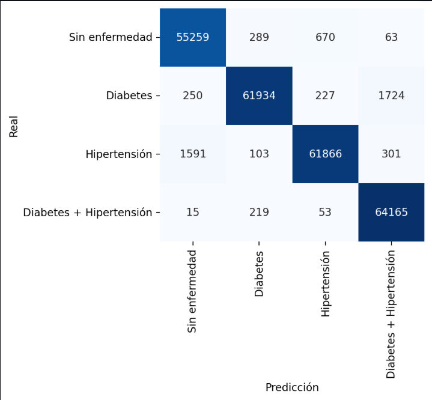

# 🧠 Sistema Inteligente de Predicción de Descompensaciones Clínicas (diabetes tipo 2, hipertensión arterial y/o comorbilidades)


**Diseñar, implementar y evaluar un sistema inteligente basado en modelos de aprendizaje automático supervisado y análisis de series de tiempo, capaz de predecir descompensaciones clínicas en pacientes con enfermedades crónicas (diabetes tipo 2, hipertensión o la combinación de ambas), utilizando datos históricos de monitoreo fisiológico, con el propósito de generar soluciones tempranas que puedan integrarse en una futura plataforma de monitoreo clínico.**

---

## 📑 Tabla de Contenidos
- [Descripción del Problema](#-descripción-del-problema)
- [Dataset](#-dataset)
- [Metodología](#-metodología)
- [Resultados](#-resultados)
- [⚙️ Instalacion y uso](#-instalacion-y-uso)
- [📗 Ejemplo de uso](#-ejemplo-de-uso)
- [💻 Interfaz de Usuario](#-interfaz-de-usuario)
- [📁 Estructura del Proyecto](#-estructura-del-proyecto)
- [⚖️ Consideraciones Éticas](#-consideraciones-éticas)
- [👥 Autores y Contribuciones](#-autores-y-contribuciones)
- [📜 Licencia](#-licencia)
- [🙏 Agradecimientos y Referencias](#-agradecimientos-y-referencias)
 

---

## 🩺 Descripción del Problema

El sistema aborda la necesidad de **predecir de manera temprana descompensaciones en pacientes con enfermedades crónicas**, principalmente **diabetes tipo 2**, **hipertensión arterial** o ambas enfermedades. El objetivo es proporcionar **alertas preventivas** basadas en el análisis de datos fisiológicos históricos, para apoyar en la toma de decisiones médicas oportunas y reducir complicaciones futuras en los pacientes.

**Importancia:**  
El monitoreo continuo de pacientes con enfermedades crónicas genera grandes volúmenes de datos. Sin herramientas inteligentes, estos datos permanecen infrautilizados. Este sistema busca **convertir información fisiológica en conocimiento clínico accionable**.

**Usuarios objetivo:**  
- Profesionales de la salud (médicos, enfermeras, analistas clínicos y gestores clínicos).  
- Investigadores en salud digital.  
- Plataformas de monitoreo remoto y telemedicina.  
- Pacientes con enfermedades crónicas (diabetes tipo 2, hipertensión y/o comorbilidad) 
- Desarrolladores e investigadores de IA clínica
---

## 📊 Dataset

- **Nombre:** `dataset_balanceado_SMOTEENN.csv`  
- **Fuente:** Dataset sintético balanceado a partir de datos clínicos reales anonimizados.  
- **Licencia:** Uso académico y de investigación.  
- **Tamaño:** ~1,000,000 registros y 24 variables.  
- **Variables principales:** `blood_glucose_level`, `HbA1c_level`, `systolic_bp`, `diastolic_bp`, `bmi`, `target` y `age`.  
- **Estructura temporal:** columna `visit` para representar series históricas.  
- **Disponibilidad:** uso interno, no público.

---

## 🧠 Metodología

### Tipo de modelo
Se utilizó un **Random Forest Classifier** por su capacidad de manejar variables correlacionadas y evitar sobreajuste sin sobremuestreo artificial. Esta elección fue especialmente adecuada para un proyecto de clasificación multiclase, dada su robustez y buen desempeño en contextos con múltiples categorías objetivo.

### Preprocesamiento
- Imputación de valores faltantes mediante reglas médico-realistas, basada en el comportamiento clínico esperado de pacientes con enfermedades crónicas.
- Creación de variable derivada: `pulse_pressure = systolic_bp - diastolic_bp`.
- Creación de Variable `Target` para analizar los pacientes con: diabetes tipo 2, hipertensión arterial y/o comorbilidades.
- Balanceo de dataset con algoritmo `Smontenn`.  
- División estratificada 75 % entrenamiento / 25 % prueba.  

### Optimización
- `max_depth = None (sin límite)` óptimo
- `min_samples_split = 2`
- `min_samples_leaf = 1`
- `n_estimators = 300`  
- `max_features='sqrt'`
- `criterion = "gini”` óptimo 
- Sin SMOTE ni sobremuestreo para mantener distribución real.  

### Métricas
- F1 score (macro)
- Precision (macro)  
- Recall (macro)
- Matriz de confusión (clases: -1, 0, 1, 2) 

---

## 📈 Resultados

| Métrica | Valor |
|----------|--------|
| Accuracy | **0.978** |
| Precision (macro) | **0.978** |
| Recall (macro) | **0.978** |
| F1 (macro) | **0.978** |


### 📊 Matriz de Confusión

<p align="center">
  
</p>
<p align="center"><em>Figura 1. Matriz de confusión del modelo Random Forest.</em></p>


> El modelo mejora un 8 % en F1 frente a un baseline de regresión logística sin balanceo.

**Variables más influyentes:** HbA1c, presión sistólica y glucosa.  
**Matriz de confusión:** equilibrio adecuado entre clases (diabetes / hipertensión).

---

## ⚙️ Instalacion y uso

### Requisitos
- Python ≥ 3.8  
- Navegador moderno (Chrome, Edge, Firefox)

### Instalación

```bash
git clone https://github.com/tuusuario/prediccion_clinica.git
cd prediccion_clinica
pip install -r requirements.txt
```

### 📗 Ejemplo de uso

Carga automática del dataset.

Entrenamiento del modelo Random Forest.

Visualización de métricas y reportes.

Simulación de nueva visita con signos vitales para predicción de riesgo.

---

### 💻 Interfaz de Usuario

Desarrollada en **Streamlit**, con cuatro secciones principales:

| Pestaña | Descripción |
|----------|-------------|
| 📊 **Resumen & Métricas** | Métricas de rendimiento, matriz de confusión, importancia de variables. |
| 👤 **Explorador por Paciente** | Análisis de evolución fisiológica por ID y visita. |
| 🔮 **Simulación (Próxima visita)** | Estimación del riesgo futuro con nuevos valores ingresados. |
| 🧪 **Detalles del Modelo** | Reporte de rendimiento completo y distribución de clases. |

---

### 📁 Estructura del Proyecto
📦 prediccion_clinica/
│
├── app.py                         # Aplicación principal Streamlit
├── dataset_balanceado_SMOTEENN.csv # Datos de entrenamiento
├── README.md                       # Documentación
└── requirements.txt                 # Dependencias

---

### ⚖️ Consideraciones Éticas

Los datos fueron anonimizados y se usan únicamente con fines académicos.
El sistema no sustituye la valoración médica profesional.
Las predicciones sirven como apoyo a la toma de decisiones clínicas.
Debe haber validación institucional antes de su uso real.
Se respeta el principio de IA responsable: transparencia, no maleficencia, justicia y explicabilidad.
El modelo busca minimizar sesgos mediante balanceo y control de clases minoritarias.

---

### 👥 Autores y Contribuciones
| Nombre | Rol |
|----------------------------------|--------------------------------------------------------------|
| **Fernando Xavier Montaño Cárdenas** | Desarrollo del modelo, interfaz Streamlit, documentación, validación experimental. |
| **María Fernanda Bolaños** | Soporte en análisis de datos, revisión de métricas y validación clínica del sistema. |

---

### 📜 Licencia

Este proyecto se distribuye bajo la licencia MIT.
Puede utilizarse y modificarse libremente con fines académicos o de investigación, citando al autor original.

---

### 🙏 Agradecimientos y Referencias
Agradecimientos

---

### Referencias

Pedregosa, F. et al. (2011). Scikit-learn: Machine Learning in Python. Journal of Machine Learning Research, 12, 2825–2830.

Streamlit Inc. (2023). Streamlit Documentation. https://docs.streamlit.io/

World Health Organization (2024). Global report on diabetes and hypertension.

Fernández, A. (2022). Machine Learning para la predicción clínica en salud digital. Universidad de Buenos Aires.
